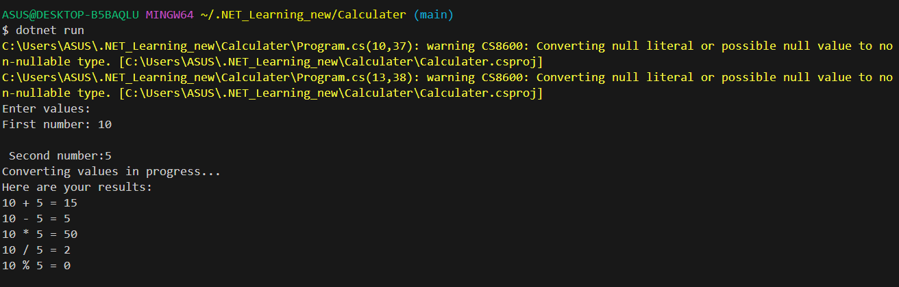

# Calculater

This project shows how can I can successfully use data types &amp; arithmetic operations

Have a look at `Program.cs` file and you can see how I have used:

* Console input/output
* Conversion between data types
* Arithmetic operations

## Demo

## Diagram

1. My model scheme:

### V1.0

We are excited to announce the release of version 1.0 of our Calculator App! This release introduces basic arithmetic calculations.

Features:

* Addition: You can now add two or more numbers using the + operator.
* Subtraction: Perform subtraction of one number from another using the - operator.
* Multiplication: Multiply numbers together using the * operator.
* Division: Divide one number by another using the / operator.
* Remainder: Divide one number by another using % operation and take the reminder.
* SquareRoot: Select "sqrt" from numbers to extract the square root.
* Pow: Select the numbers and select "pow" to get the desired result and get the desired result for yourself.

